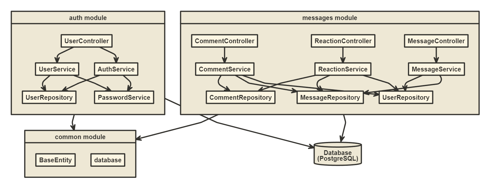

# Social Wires Backend
 Bienvenido al proyecto Social Wires Backend. Esta API ha sido desarrollada utilizando tecnologías como NestJS, Typescript, PostgreSQL, Docker, AWS y GitHub Actions. Su propósito principal es crear una plataforma de redes sociales donde los usuarios pueden publicar mensajes y permitir que otros usuarios comenten y reaccionen a ellos. Si deseas obtener más información sobre cómo utilizar la API, puedes consultar la documentación en la siguiente URL:

http://ec2-18-117-164-144.us-east-2.compute.amazonaws.com:3000/api

## Para correr el proyecto localmente:

Se debe crear un archivo .env con la siguiente información en el directorio del proyecto:
```bash
DB_HOST=localhost

DB_PORT=5432

DB_USERNAME=social_user

DB_PASSWORD=123456

DB_DATABASE=social_wired_db
```

Luego para correr la aplicación se debe ejecutar el siguiente comando en la consola en la ubicación del proyecto:

```bash
$ docker-compose up
```

Luego ejecutar las migraciones con el comando:

```bash
$ npm run migration:run
```

Finalmente ejecutar:

```bash
$ npm run start
```

Utiliza la API con los siguientes pasos:

- Crear un nuevo usuario con el endpoint de CreateUser.
- Crear mensajes
- Crear reacciones
- Crear comentarios
- Obtener todos los mensajes, obtener los mensajes por id y por id del usuario.
- Borrar mensajes.


## Arquitectura

La aplicación se compone de tres módulos:

### messages
El módulo messages gestiona a todo lo relacionado a los mensajes escritos por los usuarios,y demas funcionalidades con respecto a estos.

### auth
El módulo auth se encarga de la gestión de usuarios y permisos de autenticación. Es responsable de garantizar que solo los usuarios autorizados puedan acceder a los recursos y funciones del sistema, así como de controlar el acceso a los datos sensibles. Este módulo es crucial para la seguridad y la protección de la información del sistema, y su correcta configuración es fundamental para asegurar su buen funcionamiento.

### common
El módulo common contiene todas las funcionalidades que tienen en común todos los otros modulos.

## Bases de datos
La base de datos utilizada para almacenar y gestionar los datos es PostgreSQL. Para crear y ejecutar las migraciones, se implementó TypeORM. El Diagrama de Relación de Entidades ilustra las diferentes entidades en el sistema y cómo se relacionan entre sí.

;

## Testing

Se realiza Unit Testing usando Jest para todos los servicios del proyecto de los diferentes modulos. Los test se encuentran ubicados en la misma carpeta de sus respectivos servicios. Para corer todos los test ejecuta:

```
npm run test
```

## Librerias
Las librerias usadas en el proyecto son:
- TypeORM: proporciona la persistencia de datos, migraciones y manejo de base de datos.
- class-validator: para realizar validaciones en el servidor.
- bcrypt: permite realizar el hasheado de las contraseñas.
- jwt: se utiliza para la autenticación y autorizacion de usuarios.
- dotenv: permite utilizar variables de entorno.
- emoji-js: permite utilizar emojis en las reacciones.
- Jest: para realizar Testing.

## CI / CD

El proyecto social-wires-backend cuenta con un sólido pipeline de CI/CD que está impulsado por Github Actions. Cada vez que se realizan cambios en la rama principal, Github Actions compila el código, ejecuta pruebas y crea una imagen de Docker de la aplicación. Esta imagen de Docker se publica en Docker Hub, donde se puede acceder y desplegar fácilmente. Finalmente se desplega en AWS usando el servicio EC2, y la instancia de EC2 que aloja la aplicación se actualiza automáticamente con la última versión del contenedor de Docker. Este proceso garantiza que la aplicación esté siempre actualizada y ejecutando la última versión del código, sin necesidad de intervención manual.

# AWS - EC2

Para alojar la aplicación Social Wires Backend y la base de datos PostgreSQL, se utilizó el servicio EC2 de Amazon Web Services. En EC2, se instaló Docker en el sistema, lo que nos permitió crear contenedores para nuestra aplicación y base de datos. Utilizando Docker, pudimos empaquetar la aplicación trips-api y sus dependencias en un solo contenedor, de la misma manera que la base de datos PostgreSQL se empaquetó en otro contenedor. Este enfoque nos permitió desplegar fácilmente nuestra aplicación y base de datos en la instancia EC2 y garantizar la consistencia entre los entornos de desarrollo y producción.


