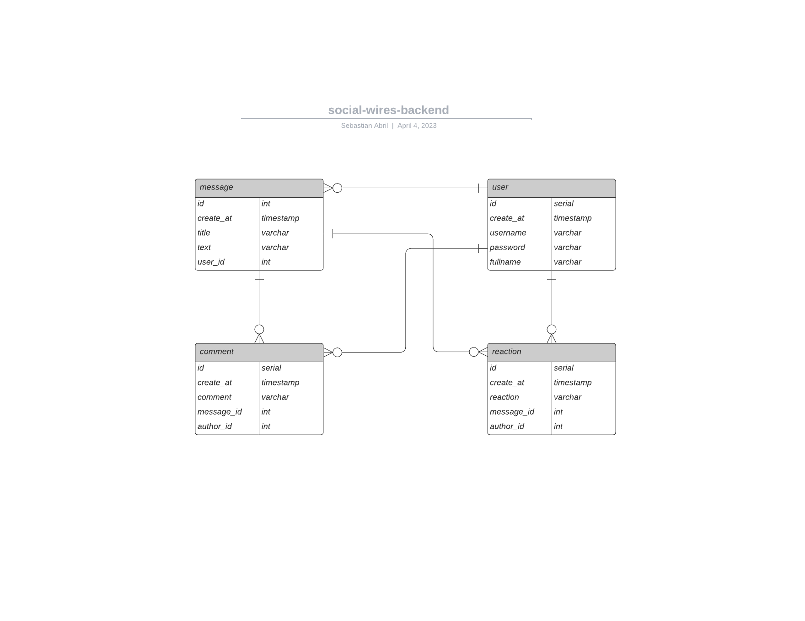

# Social Wires Backend
 Es una API desarrollada con NestJS y Typescript que consiste en una red social donde las personas publican mensajes, y los demás usuarios podrán comentar y reaccionar a estos.

 Las tecnologías usadas para la creación del proyecto son:
 - NestJS
 - PostgreSQL
 - TypeORM
 - Docker

# Arquitectura
La aplicación se compone de tres módulos:

## messages
El módulo messages gestiona a todo lo relacionado a los mensajes escritos por los usuarios,y demas funcionalidades con respecto a estos.

## auth
El módulo auth se encarga de la gestión de usuarios y permisos de autenticación. Es responsable de garantizar que solo los usuarios autorizados puedan acceder a los recursos y funciones del sistema, así como de controlar el acceso a los datos sensibles. Este módulo es crucial para la seguridad y la protección de la información del sistema, y su correcta configuración es fundamental para asegurar su buen funcionamiento.

## common
El módulo common contiene todas las funcionalidades que tienen en común todos los demás modulos.

# Endpoints

## Signup

Module: auth

Method: POST

Path: http://localhost:3000/wires/auth/signup  

Request Payload:
```bash
  {
    "username": "Sebastian",
    "email": "sebastian1111@gmail.com",
    "password": "123456",
    "fullname": "Juan Sebastian Abril Perez"
  }
```
Response Payload:
```bash
  {
    "username": "Sebastian",
    "fullname": "Juan Sebastian Abril Perez",
    "id": 6,
    "createAt": "2023-04-04T21:27:47.485Z"
  }

```

## Create message

Module: messages

Method: POST

Path: http://localhost:3000/wires/messages/  

Request Payload:
```bash
  {
    "title": "buenos días",
    "content": "El dia esta chill"
  }
```
Response Payload:
```bash
  {
    "id": 6,
    "user": 1,
    "title": "buenos días",
    "text": "El dia esta chill"
  }

```

## Get all messages

Modulo: messages

Method: GET

Path: http://localhost:3000/wires/messages

Response Payload:
```bash
  
   [ {
        "id": 2,
        "user": 1,
        "title": "buenas noches",
        "text": "la noche esta serena",
        "reactions": []
      }
    ] 
  

```

## Get messages by user id

Modulo: messages

Method: GET

Path: http://localhost:3000/wires/messages/me/:id

Response Payload:
```bash
  {
   [
     {
        "id": 9,
        "user": 3,
        "title": "BOBNOBOAJAFASFE",
        "text": "MNI perro eswta bien",
        "reactions": []
      }
    ]
  }

```
## Get only message by id

Module: messages

Method: POST

Path: http://localhost:3000/wires/messages/message/2

## Create reaction

## Create new user

## Create comment

## Delete Message


# Estructura de Tablas

;


## Correr el proyecto
Se debe crear un archivo .env con la siguiente información en el directorio del proyecto:
```bash
DB_HOST=localhost

DB_PORT=5432

DB_USERNAME=social_user

DB_PASSWORD=123456

DB_DATABASE=social_wired_db
```


Luego para correr la aplicación se debe ejecutar el siguiente comando en la consola en la ubicación del proyecto:

```bash
$ docker-compose up
```

Luego ejecutar las migraciones con el comando:

```bash
$ npm run migration:run
```

Finalmente ejecutar:

```bash
$ npm run start
```


- Crear un nuevo usuario con el endpoint de CreateUser.
- Crear mensajes
- Crear reacciones
- Crear comentarios
- Obtener todos los mensajes, obtener los mensajes por id y por id del usuario.
- Borrar mensajes.


